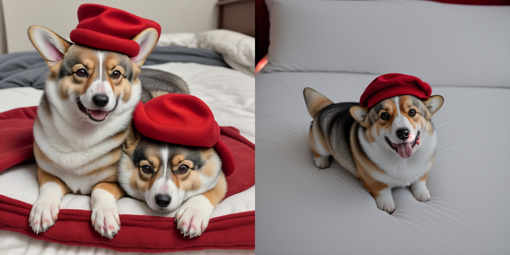

# Upsampling Guidance
this is unoffical implement for the paper [Upsample Guidance: Scale Up Diffusion Models without Training](https://arxiv.org/abs/2404.01709)

example code in `tmp.py`, currently only implement for Stable Diffusion 1.5, results looks good for a free launch method.

SDXL code will be later.

# Part of results
left is SD15 generate `1024x1024` image, right is SD15 with upsampling guidance generated `1024x1024` image

